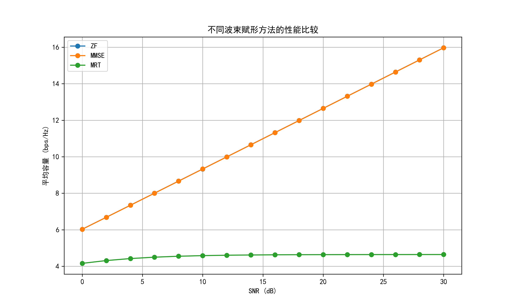
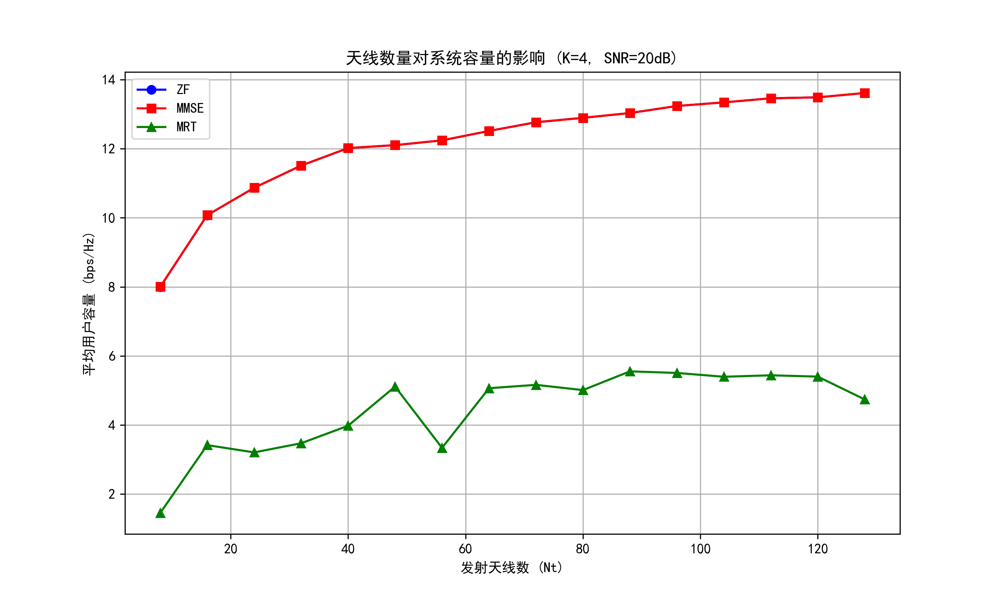

# 5G毫米波通信信道传播模型分析报告

*生成日期: 2025-05-15*

## 1. 引言

本报告对5G毫米波通信中的信道传播特性进行了全面分析，包括基于菲涅尔区原理的路径损耗计算、双径传播模型下的频率选择性衰落、瑞利和莱斯信道下的BER性能，以及Massive MIMO波束赋形算法的性能评估。

毫米波通信（频率范围通常为24-100GHz）是5G及未来6G网络的关键技术，其提供了大量可用带宽，但同时也面临严重的路径损耗和阻塞问题。本报告通过数学建模和仿真分析，系统地研究了毫米波通信中的各种信道特性和传输技术。

## 2. 菲涅尔区与路径损耗分析

菲涅尔区是无线通信中的重要概念，特别是在毫米波频段，由于波长较短，障碍物对信号传播的影响更为显著。本节分析了不同障碍物相对余隙(h_c/F1)对路径损耗的影响。

从图中可以看出，当障碍物高度增加时，路径损耗显著增加。特别是当障碍物高度接近或超过第一菲涅尔区半径时，附加损耗可达10dB以上，这将严重影响链路可靠性。在毫米波频段，由于波长短，菲涅尔区半径相对较小，因此即使较小的障碍物也可能导致显著的信号衰减。

### 2.1 菲涅尔区数学模型

第n个菲涅尔区半径可以通过以下公式计算：

$$F_n = \sqrt{rac{n\lambda d_1 d_2}{d_1 + d_2}}$$

其中：
- $F_n$ 是第n个菲涅尔区半径
- $\lambda$ 是波长
- $d_1$ 和 $d_2$ 是发射机和接收机到障碍物的距离

当障碍物进入第一菲涅尔区时，会产生衍射损耗，可以通过相对余隙 $v = h_c/F_1$ 来计算：

$$J(v) = 6.9 + 20\log_{10}(\sqrt{(v-0.1)^2+1} + v - 0.1)$$

这种衍射损耗会直接影响链路预算和系统可靠性。

## 3. 双径传播与频率选择性衰落

在毫米波通信中，由于波长短，反射信号与直射信号的干涉更为明显，导致频率选择性衰落。

从图中可以观察到，随着距离的增加，信道的频率选择性特征更为明显。这是因为直射路径与反射路径的时延差增大，导致相位差在频域上的变化更快。这种频率选择性衰落会导致部分子载波信号严重衰减，需要通过OFDM等技术来缓解。

### 3.1 双径传播模型

在双径模型中，接收信号由直射路径和反射路径组成：

$$h(t) = lpha_1\delta(t-	au_1) + lpha_2\delta(t-	au_2)$$

其中 $lpha_1$ 和 $lpha_2$ 分别是直射路径和反射路径的复增益，$	au_1$ 和 $	au_2$ 是对应的传播时延。

在频域中，信道传输函数为：

$$H(f) = lpha_1e^{-j2\pi f	au_1} + lpha_2e^{-j2\pi f	au_2}$$

当频率变化时，两路信号的相位差也随之变化，导致在某些频率点上信号增强，而在其他频率点上信号减弱，形成频率选择性衰落。

## 4. 瑞利与莱斯信道下的BER性能

毫米波信道通常可以用瑞利或莱斯模型来描述，取决于是否存在强直射分量。

从图中可以看出，瑞利信道下的BER性能最差，这是因为瑞利信道假设没有直射分量，完全由散射分量组成。而莱斯信道由于存在直射分量，性能明显优于瑞利信道，且K因子越大，性能越接近AWGN信道。

### 4.1 瑞利衰落信道模型

瑞利衰落信道的复增益可以表示为：

$$h = h_I + jh_Q$$

其中 $h_I$ 和 $h_Q$ 是独立同分布的高斯随机变量，均值为0，方差为 $\sigma^2/2$。信道增益的幅度 $|h|$ 服从瑞利分布：

$$f_{|h|}(x) = rac{x}{\sigma^2}e^{-rac{x^2}{2\sigma^2}}, x \geq 0$$

### 4.2 莱斯衰落信道模型

莱斯衰落信道包含一个确定性直射分量和随机散射分量：

$$h = \sqrt{rac{K}{K+1}} + \sqrt{rac{1}{K+1}}(h_I + jh_Q)$$

其中K是莱斯因子，表示直射分量与散射分量功率之比。信道增益的幅度 $|h|$ 服从莱斯分布。

## 5. Massive MIMO波束赋形性能分析

Massive MIMO是5G毫米波通信的关键技术，通过大规模天线阵列实现空间复用和波束赋形，提高系统容量和能量效率。

从图中可以看出，随着天线数量的增加，系统容量显著提高。MMSE波束赋形在低SNR区域优于ZF波束赋形，这是因为MMSE考虑了噪声的影响，而ZF只关注干扰消除。

### 5.1 不同波束赋形算法比较

上图比较了ZF、MMSE和MRT三种波束赋形算法的性能。可以看出：
- MRT在低SNR区域表现较好，但在高SNR区域受到干扰限制
- ZF在高SNR区域表现优异，但在低SNR区域受到噪声增强的影响
- MMSE在各种SNR条件下都能取得较好的平衡

### 5.2 多用户干扰抑制能力

上图分析了不同波束赋形算法的多用户干扰抑制能力。随着用户数的增加，所有算法的SINR都会下降，但ZF和MMSE能够更有效地抑制多用户干扰。特别是在用户数接近天线数时，MRT的性能急剧下降，而ZF和MMSE仍能保持较好的性能。

### 5.3 天线数量对系统容量的影响

上图展示了天线数量对系统容量的影响。可以看出，随着天线数量的增加，系统容量呈对数增长趋势。这验证了Massive MIMO的理论预测：当天线数趋于无穷大时，多用户干扰可以被完全消除。

## 6. 技术挑战与未来发展

尽管毫米波Massive MIMO技术具有巨大潜力，但仍面临以下挑战：

1. **信道估计复杂性**：大规模天线阵列导致信道估计开销巨大，需要开发高效的信道估计算法。

2. **硬件实现难度**：高频段下的RF链路设计、相位噪声控制和功率放大器效率都是挑战。

3. **波束管理**：在移动场景下，需要快速准确的波束跟踪和切换机制。

4. **阻塞敏感性**：毫米波信号容易被障碍物阻挡，需要多连接或快速重路由机制。

未来研究方向包括：
- 结合机器学习的智能波束管理
- 分布式Massive MIMO架构
- 集成感知与通信的联合设计
- 超表面辅助的毫米波传播

## 7. 结论

本报告通过数学建模和仿真分析，系统地研究了5G毫米波通信中的信道传播特性和Massive MIMO波束赋形技术。表明，毫米波通信虽然面临严重的路径损耗和阻塞问题，但通过Massive MIMO波束赋形技术可以有效克服这些挑战，实现高速、可靠的无线通信。

不同的波束赋形算法在不同场景下各有优势：ZF适合高SNR和干扰受限场景，MMSE能在各种条件下取得较好平衡，而MRT则适合低SNR和计算资源受限的场景。系统设计时应根据具体应用需求选择合适的算法。

## 8. 参考文献

1. T. S. Rappaport et al., "Millimeter Wave Mobile Communications for 5G Cellular: It Will Work!" IEEE Access, vol. 1, pp. 335-349, 2013.

2. E. G. Larsson, O. Edfors, F. Tufvesson, and T. L. Marzetta, "Massive MIMO for next generation wireless systems," IEEE Communications Magazine, vol. 52, no. 2, pp. 186-195, 2014.

3. A. L. Swindlehurst, E. Ayanoglu, P. Heydari, and F. Capolino, "Millimeter-wave massive MIMO: The next wireless revolution?" IEEE Communications Magazine, vol. 52, no. 9, pp. 56-62, 2014.

4. W. Roh et al., "Millimeter-wave beamforming as an enabling technology for 5G cellular communications: Theoretical feasibility and prototype results," IEEE Communications Magazine, vol. 52, no. 2, pp. 106-113, 2014.

5. S. Han, C. I, Z. Xu, and C. Rowell, "Large-scale antenna systems with hybrid analog and digital beamforming for millimeter wave 5G," IEEE Communications Magazine, vol. 53, no. 1, pp. 186-194, 2015.

6. J. G. Andrews et al., "What Will 5G Be?" IEEE Journal on Selected Areas in Communications, vol. 32, no. 6, pp. 1065-1082, 2014.
